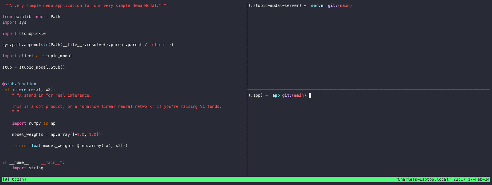

# MiniModal
<p align="center">
    
</p>

## Overview

MiniModal is a toy project showing off the very simplest features of Modal that a smol brain Python developer,
like [me](https://twitter.com/charles_irl),
needs to grok to be able to use it effectively.

Inspired by
`@karpathy`'s [nanoGPT](https://github.com/karpathy/nanoGPT)
and
[Build-Your-Own-X](https://github.com/codecrafters-io/build-your-own-x),
this project focuses on building the core features of Modal's gRPC-based remote function execution from simpler pieces,
with eyes on intuition rather than on feature parity, robustness, or performance.

Note: some code in the gRPC section was modified from the
[grpc.io tutorial for Python](https://grpc.io/docs/languages/python/basics/).

## Features

- gRPC-based Communication: Utilizes gRPC for client-server communication, just like big girl Modal.
- Remote Python Execution: Sends Python modules, functions, and arguments from client to server for execution, just like big girl Modal

## Video

<p align="center">
    
</p>


## Project Structure

```bash
.
├── app  # Simple version of code a Modal user would write
│   └── app.py
├── client  # Simple version of the Modal client package
│   └── minimodal
│       ├── client.py # Simple version of Modal's client code
│       ├── cli.py # Simple version of Modal's command line tool
├── common # Simple version of Modal communication protocol
│   └── protos
│       └── minimodal.proto
└── server # Simple version of Modal's server code
    └── server.py
```

## Setup

### Install Dependencies

In `./server`
create a virtual environment in a subfolder called `.server` however you like
(I used [`uv venv`](https://github.com/astral-sh/uv),
to stay on trend),
then install the local `requirements.txt` file.

### Generate gRPC Code:

From the `server` directory, run:

```bash
source .server/bin/activate
python -m grpc_tools.protoc -I../common/protos --python_out=../common/generated/python --grpc_python_out=../common/generated/python ../common/protos/minimodal.proto
```

## Running the Demo

### Start the Server

Navigate to the server directory and run:

```bash
source .server/bin/activate
python server.py
```

This starts a gRPC server on `localhost` at port `50051`.

The "RPC" in "gRPC" stands for "Remote Procedure Call",
aka a call to a function somewhere else.
(The "g" stands for "gRPC", because Google,
and that's also why the "e" stands for "ergonomics").

For Modal, that "somewhere else" is
"somewhere in our global cloud infrastructure".

For MiniModal, that's just another Python process
on the same machine.

### Set up the "local" environment for the "app"

Open a new terminal, navigate to the `./app` directory, create a new
virtual environment in a subfolder called `.app`, and install the dependencies:

```bash
source .app/bin/activate
pip install -r requirements.txt
```

This installs the `client` as an editable library,
so you can play with it as well.

### Run a function on MiniModal

Modal takes your code and runs it in the cloud.

MiniModal takes your code and runs it on your computer.

In the `./app` directory,
run `app.py`:

```bash
source .app/bin/activate
minimodal run app.py
```

Follow the on-screen prompts to execute the  `app.inference` function
on the server.

Notice that `.local` execution on the client fails!

Even in MiniModal, we can set it up so that the server can do
things the client can't -- in this case, the server has `numpy` on it.

In grown-up Modal, the server might
[have a GPU](https://modal.com/docs/guide/gpu),
or it might be
[100 containers running at once](https://modal.com/docs/guide/scale),
or it might have
[already loaded the weights of a large neural network into its memory](https://modal.com/docs/guide/lifecycle-functions),
or it might be
[all those simultaneously and also a web host](https://modal.com/blog/embedding-wikipedia).

But from the client side, it's still just Python code and decorators.
Pretty slick, right?

## License

This project is open-sourced under the MIT License. See the `LICENSE` file for more details.
